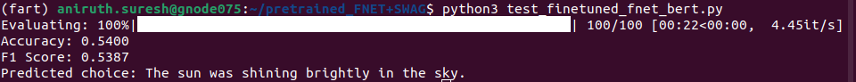
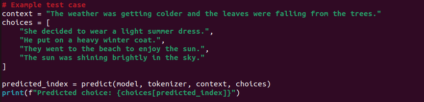
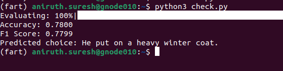

# FNET + SWAG 


## **Usage**  

Run the following commands to train and evaluate the model:

```bash

cd fnet-swag

# Fine-tune the model and save the checkpoint after full training
python fnet_swag_fine_tuning.py  

# Evaluate the fine-tuned model (outputs accuracy, F1 score, and a sample prediction)
python test_finetuned_fnet_base.py  
```

---


## **Pretrained Weights**  
Fine-tuned **FNET** on the **SWAG dataset** for multiple-choice Q/A can be downloaded from:  

Test 1 : [**Download Weights**](https://iiithydstudents-my.sharepoint.com/:f:/g/personal/aryan_garg_students_iiit_ac_in/EmNdN3AwkUdNmVYGxOkmv58Bi8FgAP-MyDX6RfOaKjnJtg?e=GHkrrS)

---

## **Results**  


Test 1 : 

 
-> not the best results 


----

# BERT + SWAG


## **Training and Evaluation Logs**  
You can view the complete run details on Weights & Biases:  
[**View Run**](https://wandb.ai/aniruthzlatan-international-institue-of-information-tech/huggingface/runs/lwdoeupd)

---

## **Usage**  

Run the following commands to train and evaluate the model:

```bash

cd bert-swag
# Fine-tune the model and save the checkpoint after full training
python fine_tune_2.py  

# Evaluate the fine-tuned model (outputs accuracy, F1 score, and a sample prediction)
python test_finetuned_model.py  
```

----

## **Pretrained Weights**  
Fine-tuned **BERT** on the **SWAG dataset** for multiple-choice Q/A can be downloaded from:  
[**Download Weights**](https://iiithydstudents-my.sharepoint.com/:f:/g/personal/aryan_garg_students_iiit_ac_in/EmNdN3AwkUdNmVYGxOkmv58Bi8FgAP-MyDX6RfOaKjnJtg?e=5X1kQl)

---

The complete loss logs of both the above tasks : 


## **Results**  






---

## **Links**

Below are the links to HuggingFace pages for the **SWAG** Dataset and **BERT** model

**BERT** : https://huggingface.co/docs/transformers/en/model_doc/bert

**SWAG** : https://huggingface.co/docs/transformers/main/en/tasks/multiple_choice
