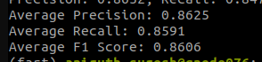

# **FART-INLP**  
Repository for maintaining all code related to the **INLP Project**.

## **Training and Evaluation Logs**  
You can view the complete run details on Weights & Biases:  

[**View Run**](https://wandb.ai/aniruthzlatan-international-institue-of-information-tech/jedi-configs/runs/xhn7f79x?nw=nwuseraniruthzlatan)

---

## **Usage**  

Run the following commands to train and evaluate the model:

```bash
# Trains the model and saves the weights and tokenizer 
python BART_finetune_training.py 

# Evaluate the fine-tuned model 
python BART_BERTSCORE_eval.py

python BART_DIALOGRPT_eval.py
```

----

## **Pretrained Weights**  

Tuned model and tokenizer weights can be found [here](https://iiithydstudents-my.sharepoint.com/:f:/g/personal/aryan_garg_students_iiit_ac_in/Eg-qghueG5pNuAla6RQsIvYBUzPpJRIDpquGAtUy7R_X2Q?e=9faa8Y)


---

## **Results**  
It uses both the encoder and the decoder and the results of evaluation of base - BART on these metrics are as shown : 

1. BART-BERT SCORE : 




2. DIALOGRPT score : 


# FART---INLP
Repo to maintain all the codes for INLP Project
